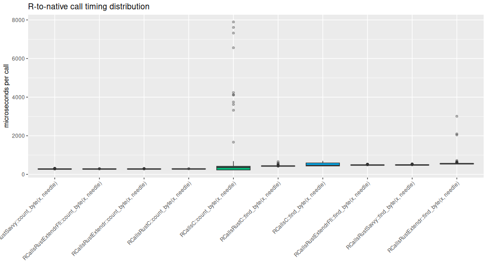

RCallsRust benchmark
================

- [Machine](#machine)
- [Results](#results)
- [Plot](#plot)

This benchmark compares five small R packages that all scan the same raw
vector and expose the same R API:

- `RCallsC`: pure C `.Call` implementation.
- `RCallsRustC`: C `.Call` wrapper plus a Rust static library.
- `RCallsRustExtendrFfi`: `extendr` registration with direct
  `extendr_ffi` use.
- `RCallsRustExtendr`: high-level `extendr` wrapper and `data_frame!`
  output.
- `RCallsRustSavvy`: `savvy` wrappers, returning a named list from Rust
  and converting to a data frame in R.

The benchmark uses the R `bench` package. All `find_byte()`
implementations use the same two-pass algorithm: count matches, allocate
output, then fill positions. Quantiles are reported because these
sub-millisecond scans can have visible scheduler/cache tails. Timing
columns are reported in microseconds; `itr_per_second` is bench’s
aggregate throughput and is not simply `1e6 / median_us`.

## Machine

| field    | value                               |
|:---------|:------------------------------------|
| system   | Linux                               |
| release  | 6.8.0-78-generic                    |
| machine  | x86_64                              |
| R        | R version 4.6.0 (2026-04-24)        |
| platform | x86_64-pc-linux-gnu                 |
| cargo    | cargo 1.91.1 (ea2d97820 2025-10-10) |
| rustc    | rustc 1.91.1 (ed61e7d7e 2025-11-07) |

## Results

| input_bytes | needle | expected_matches | iterations |
|------------:|-------:|-----------------:|-----------:|
|       1e+06 |     65 |               10 |        500 |

| binding                       | input_bytes | iterations | result_size |   min_us |   p25_us | median_us |   p75_us |   p95_us |    max_us | itr_per_second | mem_alloc_bytes | gc_per_second |
|:------------------------------|------------:|-----------:|------------:|---------:|---------:|----------:|---------:|---------:|----------:|---------------:|----------------:|--------------:|
| savvy count                   |       1e+06 |        500 |          10 | 274.1180 | 275.9620 |  277.5741 | 279.5189 | 288.9638 |  319.0471 |       3587.761 |               0 |       0.00000 |
| extendr_ffi count             |       1e+06 |        500 |          10 | 274.5701 | 276.6325 |  277.8636 | 280.7488 | 283.7514 |  299.2831 |       3587.691 |               0 |       0.00000 |
| extendr high-level count      |       1e+06 |        500 |          10 | 274.3921 | 277.0146 |  278.9015 | 281.7881 | 285.9046 |  304.5111 |       3575.190 |               0 |       0.00000 |
| C .Call + Rust count          |       1e+06 |        500 |          10 | 279.4360 | 279.8498 |  280.3025 | 284.7888 | 286.5837 |  294.1310 |       3548.835 |               0 |       0.00000 |
| pure C count                  |       1e+06 |        500 |          10 | 216.5271 | 229.1181 |  365.6086 | 418.8951 | 606.4318 | 7896.4430 |       2256.996 |               0 |       0.00000 |
| C .Call + Rust data.frame     |       1e+06 |        500 |          10 | 430.6261 | 430.9888 |  432.5226 | 435.8768 | 448.1781 |  657.2721 |       2291.716 |               0 |       0.00000 |
| pure C data.frame             |       1e+06 |        500 |          10 | 425.4931 | 438.3191 |  461.1296 | 589.3063 | 671.0332 |  698.4890 |       1964.029 |               0 |       0.00000 |
| extendr_ffi data.frame        |       1e+06 |        500 |          10 | 478.1591 | 481.0969 |  483.0266 | 488.9756 | 500.0880 |  532.4010 |       2057.343 |               0 |       0.00000 |
| savvy list + R data.frame     |       1e+06 |        500 |          10 | 481.7910 | 484.7475 |  486.5221 | 493.8008 | 502.8116 |  549.4121 |       2041.929 |               0 |       0.00000 |
| extendr high-level data.frame |       1e+06 |        500 |          10 | 535.1101 | 539.9276 |  551.6760 | 560.9744 | 585.6493 | 3006.8770 |       1804.769 |               0 |      10.89398 |

## Plot

<!-- -->

The CSV artifact is written to
/root/RCallsRust/benchmark-results/r-calls-rust.csv; the raw
`bench::mark()` object used for the plot is written to
/root/RCallsRust/benchmark-results/r-calls-rust.rds.
